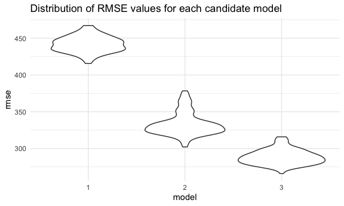
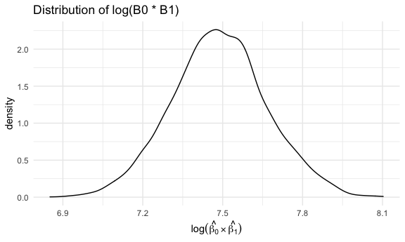
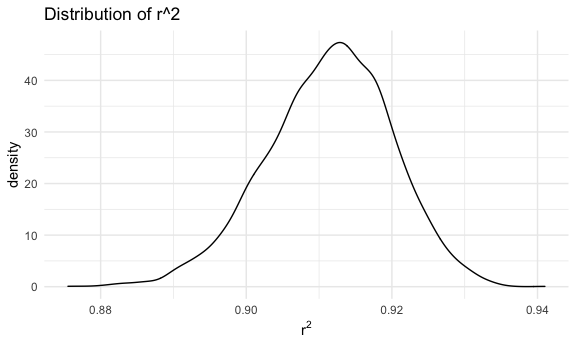

p8105\_hw6\_rr3423.Rmd
================
Ragyie Rawal

## PROBLEM 1

### Loading data for regression analysis

``` r
# loading data
birthweight_data = read_csv("data/birthweight.csv")
```

    ## Rows: 4342 Columns: 20

    ## ── Column specification ────────────────────────────────────────────────────────
    ## Delimiter: ","
    ## dbl (20): babysex, bhead, blength, bwt, delwt, fincome, frace, gaweeks, malf...

    ## 
    ## ℹ Use `spec()` to retrieve the full column specification for this data.
    ## ℹ Specify the column types or set `show_col_types = FALSE` to quiet this message.

### Checking for missing data by identifying any NA values in columns

``` r
# checking for NA values 
birthweight_data %>% 
  summarise(across(everything(), ~ sum(is.na(.)))) %>% 
  knitr::kable()
```

| babysex | bhead | blength | bwt | delwt | fincome | frace | gaweeks | malform | menarche | mheight | momage | mrace | parity | pnumlbw | pnumsga | ppbmi | ppwt | smoken | wtgain |
|--------:|------:|--------:|----:|------:|--------:|------:|--------:|--------:|---------:|--------:|-------:|------:|-------:|--------:|--------:|------:|-----:|-------:|-------:|
|       0 |     0 |       0 |   0 |     0 |       0 |     0 |       0 |       0 |        0 |       0 |      0 |     0 |      0 |       0 |       0 |     0 |    0 |      0 |      0 |

There are no NA values, thus no missing data in the birthweight dataset.

### Converting numeric to factor or logical variables for regression analysis

Determining the class of each variable in the birthweight dataset:

``` r
# checking class of each variable
birthweight_data %>% 
  map(class)
```

    ## $babysex
    ## [1] "numeric"
    ## 
    ## $bhead
    ## [1] "numeric"
    ## 
    ## $blength
    ## [1] "numeric"
    ## 
    ## $bwt
    ## [1] "numeric"
    ## 
    ## $delwt
    ## [1] "numeric"
    ## 
    ## $fincome
    ## [1] "numeric"
    ## 
    ## $frace
    ## [1] "numeric"
    ## 
    ## $gaweeks
    ## [1] "numeric"
    ## 
    ## $malform
    ## [1] "numeric"
    ## 
    ## $menarche
    ## [1] "numeric"
    ## 
    ## $mheight
    ## [1] "numeric"
    ## 
    ## $momage
    ## [1] "numeric"
    ## 
    ## $mrace
    ## [1] "numeric"
    ## 
    ## $parity
    ## [1] "numeric"
    ## 
    ## $pnumlbw
    ## [1] "numeric"
    ## 
    ## $pnumsga
    ## [1] "numeric"
    ## 
    ## $ppbmi
    ## [1] "numeric"
    ## 
    ## $ppwt
    ## [1] "numeric"
    ## 
    ## $smoken
    ## [1] "numeric"
    ## 
    ## $wtgain
    ## [1] "numeric"

All of the variables in the birthweight dataset are numeric.

There are three numeric categorical variables in the dataset which
should be converted to factor variables (based on the homework dataset
description): babysex, frace, and mrace. The malform variable should be
converted to a logical variable because it is corresponding to a binary
choice (0 = absent or 1 = present).

Checking the distinct categories in each variable:

``` r
# checking distinct categories for variables
birthweight_data %>% 
  distinct(babysex)
```

    ## # A tibble: 2 × 1
    ##   babysex
    ##     <dbl>
    ## 1       2
    ## 2       1

``` r
birthweight_data %>% 
  distinct(frace)
```

    ## # A tibble: 5 × 1
    ##   frace
    ##   <dbl>
    ## 1     1
    ## 2     2
    ## 3     3
    ## 4     4
    ## 5     8

``` r
birthweight_data %>% 
  distinct(malform)
```

    ## # A tibble: 2 × 1
    ##   malform
    ##     <dbl>
    ## 1       0
    ## 2       1

``` r
birthweight_data %>% 
  distinct(mrace)
```

    ## # A tibble: 4 × 1
    ##   mrace
    ##   <dbl>
    ## 1     1
    ## 2     2
    ## 3     3
    ## 4     4

The babysex variable has two distinct categories, which are consistent
with the homework data description. The frace variable only has five
distinct categories, which are not consistent with the homework data
description (category 9 ‘unknown’ is not included in this dataset). The
malform variable has two distinct categories, which are consistent with
the homework data description. The mrace variable only has four distinct
categories, which are not consistent with the homework data description
(category 8 ‘other’ is not included in this dataset).

Converting the numeric variables to factor or logical variables to tidy
the data for regression analysis:

``` r
# tidying dataset for regression analysis
birthweight_df = 
  birthweight_data %>% 
  janitor::clean_names() %>% 
  mutate(
    babysex = recode(babysex, "1" = "male", "2" = "female"),
    babysex = factor(babysex, levels = c("male", "female")),
    frace = recode(frace, "1" = "White", "2" = "Black", "3" = "Asian",
                   "4" = "Puerto Rican", "8" = "Other"),
    frace = factor(frace, levels = c("White", "Black", "Asian",
                                     "Puerto Rican", "Other")),
    malform = as.logical(malform),
    mrace = recode(mrace, "1" = "White", "2" = "Black", 
                   "3" = "Asian", "4" = "Puerto Rican"),
    mrace = factor(mrace, levels = c("White", "Black", "Asian", "Puerto Rican"))
  )
```

### Describing the birthweight dataset

``` r
# key variables in dataset
variables_bw = 
  birthweight_df %>% 
  names()

# number of rows in dataset
rows_bw = 
  birthweight_df %>% 
  nrow()

# number of columns in dataset
columns_bw = 
  birthweight_df %>% 
  ncol()
```

The **key variables** in the birthweight dataset are babysex, bhead,
blength, bwt, delwt, fincome, frace, gaweeks, malform, menarche,
mheight, momage, mrace, parity, pnumlbw, pnumsga, ppbmi, ppwt, smoken,
wtgain. The **number of rows** in the birthweight dataset is 4342. The
**number of columns** in the birthweight dataset is 20.

### Proposing a regression model for birthweight

I am hypothesizing that the following variables are factors that underly
birthweight (might be predictors of birthweight): family income
(fincome), gestational age in weeks (gaweeks), mother’s age at delivery
in years (momage), mother’s race (mrace), and mother’s weight gain
during pregnancy in pounds (wtgain).

Family income could affect the amount and quality of food that is
available to the mother during pregnancy, thus affecting the child’s
birthweight. Gestational age in weeks could affect the child’s
birthweight because lower gestational age could mean the child is less
developed with a smaller birthweight while higher gestational age could
mean the child is more developed which a larger birthweight. Mother’s
age at delivery could affect child’s birthweight as well, since older
maternal age at delivery could increase risk for lower child
birthweight. Mother’s race could affect child’s birthweight since there
could be disparities in birthweight by race. Finally, mother’s weight
gain during pregnancy could affect child’s birthweight since less weight
gain for the mother might indicate lower child birthweight while more
weight gain for the mother might indicate higher child birthweight.

My proposed regression model for birthweight is:

``` r
# linear regression model
fit = lm(bwt ~ fincome + gaweeks + momage + mrace + wtgain, data = birthweight_df)
```

Tidying the output of the linear regression model:

``` r
# tidying linear model output
fit %>% 
  broom::tidy() %>% 
  select(term, estimate, p.value) %>% 
  knitr::kable(digits = 3)
```

| term              | estimate | p.value |
|:------------------|---------:|--------:|
| (Intercept)       |  745.448 |   0.000 |
| fincome           |    0.539 |   0.062 |
| gaweeks           |   54.709 |   0.000 |
| momage            |    4.486 |   0.019 |
| mraceBlack        | -224.106 |   0.000 |
| mraceAsian        | -123.824 |   0.070 |
| mracePuerto Rican | -129.816 |   0.000 |
| wtgain            |    9.248 |   0.000 |

At an alpha = 0.05 significance level, the following factors are
significant because they have a p-value less than 0.05 in the linear
regression model output: gaweeks, momage, mraceBlack, mracePuerto Rican,
and wtgain. The following factors are not significant because they have
a p-value greater than 0.05: fincome and mraceAsian.

In order to further improve my proposed regression model, I will remove
the fincome factor since it was not significant. Thus, my improved
proposed regression model is as follows:

``` r
# improving linear regression model
fit_2 = lm(bwt ~ gaweeks + momage + mrace + wtgain, data = birthweight_df)
```

Tidying the output of the improved linear regression model:

``` r
# tidying output of fit_2
fit_2 %>% 
  broom::tidy() %>% 
  select(term, estimate, p.value) %>% 
  knitr::kable(digits = 3)
```

| term              | estimate | p.value |
|:------------------|---------:|--------:|
| (Intercept)       |  754.067 |   0.000 |
| gaweeks           |   54.816 |   0.000 |
| momage            |    5.259 |   0.005 |
| mraceBlack        | -233.207 |   0.000 |
| mraceAsian        | -132.365 |   0.053 |
| mracePuerto Rican | -138.459 |   0.000 |
| wtgain            |    9.238 |   0.000 |

At an alpha = 0.05 significance level, the following factors are
significant because they have a p-value less than 0.05 in the linear
regression model output: gaweeks, momage, mraceBlack, mracePuerto Rican,
and wtgain. The mraceAsian factor is not significant because the p-value
is greater that 0.05, but not as much as it was in my original proposed
linear model.

### Creating a plot of model residuals against fitted values

Adding residuals and fitted values to the birthweight dataframe and
creating plot

``` r
# creating residuals vs. fitted values plot  
birthweight_df %>% 
  add_residuals(fit_2) %>% 
  add_predictions(fit_2) %>% 
  ggplot(aes(x = pred, y = resid)) + 
  geom_point() +
  labs(
   title = "Plot of model residuals against fitted values",
   x = "Predicted/fitted value",
   y = "Residual"
  )
```


The residuals vs. fitted/predicted values plot is used to detect error
variance (heteroscedasticity). In an ideal situation, I would like to
see a random pattern with residual values that are evenly distributed
around 0 with no unusual values that stand out from the random pattern.
This plot based on my proposed regression model is relatively good,
since there is a pretty random pattern and the residual values are
relatively evenly distributed around 0.

Thus, I will be using this improved regression model as my proposed
regression model for birthweight, and I propose that the factors
underlying birthweight are gaweeks, momage, mrace, and wtgain.

### Comparing my model to two other models

Creating and tidying output of model using length at birth and
gestational age as predictors (main effects only)

``` r
# creating model using blength and gaweeks as predictors 
lm_2 = lm(bwt ~ blength + gaweeks, data = birthweight_df)

# tidying modeloutput
lm_2 %>% 
  broom::tidy() %>% 
  select(term, estimate, p.value) %>% 
  knitr::kable(digits = 3)
```

| term        |  estimate | p.value |
|:------------|----------:|--------:|
| (Intercept) | -4347.667 |       0 |
| blength     |   128.556 |       0 |
| gaweeks     |    27.047 |       0 |

Creating and tidying output of model using head circumference, length,
sex, and all interactions (including the three-way interaction) between
these

``` r
# creating model of all interactions between head circumference, length, and sex
lm_3 = lm(bwt ~ bhead*blength*babysex, data = birthweight_df)

# tidying model output
lm_3 %>% 
  broom::tidy() %>% 
  select(term, estimate, p.value) %>%  
  knitr::kable(digits = 3)
```

| term                        |  estimate | p.value |
|:----------------------------|----------:|--------:|
| (Intercept)                 | -7176.817 |   0.000 |
| bhead                       |   181.796 |   0.000 |
| blength                     |   102.127 |   0.000 |
| babysexfemale               |  6374.868 |   0.000 |
| bhead:blength               |    -0.554 |   0.478 |
| bhead:babysexfemale         |  -198.393 |   0.000 |
| blength:babysexfemale       |  -123.773 |   0.000 |
| bhead:blength:babysexfemale |     3.878 |   0.000 |

### Comparing models in terms of the cross-validated prediction error

Comparing models using cross validation:

``` r
# using crossv_mc
cv_df = 
  crossv_mc(birthweight_df, 100) %>%
  mutate(
    train = map(train, as_tibble),
    test = map(test, as_tibble)
  )

# fitting candidate models and obtaining RMSEs
cv_df = 
  cv_df %>% 
  mutate(
    model_1 = map(train, ~lm(bwt ~ gaweeks + momage + mrace + wtgain, data = .x)),
    model_2 = map(train, ~lm(bwt ~ blength + gaweeks, data = .x)),
    model_3 = map(train, ~lm(bwt ~ bhead*blength*babysex, data = .x))
  ) %>% 
  mutate(
    rmse_1 = map2_dbl(model_1, test, ~rmse(model = .x, data = .y)),
    rmse_2 = map2_dbl(model_2, test, ~rmse(model = .x, data = .y)),
    rmse_3 = map2_dbl(model_3, test, ~rmse(model = .x, data = .y))
  )
```

Creating plot showing the distribution of RMSE values for each candidate
model

``` r
# creating plot of RMSE values for each model
cv_df %>% 
  select(starts_with("rmse")) %>% 
  pivot_longer(
    everything(),
    names_to = "model",
    values_to = "rmse",
    names_prefix = "rmse_"
  ) %>% 
  mutate(model = fct_inorder(model)) %>% 
  ggplot(aes(x = model, y = rmse)) + 
  geom_violin() + 
  labs(
    title = "Distribution of RMSE values for each candidate model"
  )
```



Model 3 seems to have the best fit because it has the lowest RMSE value
and thus has the best prediction accuracy . Model 1 seems to have the
worst fit because it has the highest RMSE value. Model 1 might be too
complex with too many variables included, which could reduce its
prediction accuracy. Model 2 might be too simple, which could also
reduce its prediction accuracy.

Based on this cross validation, it appears that baby’s head
circumference at birth, baby’s length at birth, and baby’s sex are
predictors for birthweight.

## PROBLEM 2

### Importing 2017 Central Park weather data

``` r
# downloading weather dataset 
weather_df = 
  rnoaa::meteo_pull_monitors(
    c("USW00094728"),
    var = c("PRCP", "TMIN", "TMAX"), 
    date_min = "2017-01-01",
    date_max = "2017-12-31") %>%
  mutate(
    name = recode(id, USW00094728 = "CentralPark_NY"),
    tmin = tmin / 10,
    tmax = tmax / 10) %>%
  select(name, id, everything())
```

    ## Registered S3 method overwritten by 'hoardr':
    ##   method           from
    ##   print.cache_info httr

    ## using cached file: ~/Library/Caches/R/noaa_ghcnd/USW00094728.dly

    ## date created (size, mb): 2021-10-05 10:30:00 (7.602)

    ## file min/max dates: 1869-01-01 / 2021-10-31

### Visualizing weather data, particularly tmax and tmin

``` r
# making a plot of tmax and tmin to visualize data
weather_df %>% 
  ggplot(aes(x = tmin, y = tmax)) + 
  geom_point() + 
  labs(
    title = "Relationship between tmin and tmax"
  )
```


Based on this graph, tmax and tmin appear to have a relatively positive
linear association

### Looking at the simple linear regression model

``` r
# simple linear regression with tmax as response and tmin as predictor
fit_weather = lm(tmax ~ tmin, data = weather_df)

# tidying the output of the simple linear regression model
fit_weather %>% 
  broom::tidy() %>% 
  select(term, estimate, p.value) %>% 
  knitr::kable(digits = 3)
```

| term        | estimate | p.value |
|:------------|---------:|--------:|
| (Intercept) |    7.209 |       0 |
| tmin        |    1.039 |       0 |

### Producing estimates of the two quantities using 5000 bootstrap samples

``` r
# getting 5000 bootstrap samples and analyzing bootstrap samples to produce estimates of the two quantities
bootstrap_results = 
  weather_df %>% 
  bootstrap(n = 5000) %>% 
  mutate(
    models = map(strap, ~lm(tmax ~ tmin, data = .x)),
    results = map(models, broom::tidy),
    summary = map(models, broom::glance)) %>% 
  select(-strap, -models) %>% 
  unnest(results) %>% 
  select(term, estimate, summary) %>% 
  unnest(summary) %>% 
  select(term, estimate, r.squared) %>% 
  pivot_wider(
    names_from = term,
    values_from = estimate
  ) %>% 
  mutate(log = tmin * `(Intercept)`)
```

### Plotting the distribution of estimates

Looking at the distribution of log (*β̂*<sub>0</sub> \* *β̂*<sub>1</sub>)

``` r
bootstrap_results %>% 
  ggplot(aes(x = log)) + 
  geom_density() + 
  xlab(expression(log(hat(beta[0]) %*% hat(beta[1])))) + 
  labs(
    title = "Distribution of log(B0 * B1)"
  )
```



The distribution of log (*β̂*<sub>0</sub> \* *β̂*<sub>1</sub>) appears
relatively normal, though there does appear to be a bit of a “shoulder”
at the top (the graph is not a smooth curve at the peak) of the graph
which could suggest the presence of outliers in the dataset.

Looking at the distribution of *r̂*<sup>2</sup>:

``` r
bootstrap_results %>% 
  ggplot(aes(x = r.squared)) + 
  geom_density() + 
  labs(
    title = "Distribution of r^2" 
  ) + 
  xlab(expression(r^2))
```



The distribution of *r̂*<sup>2</sup> appears relatively normal with a
bell-shaped curve.

### Getting the 95% confidence intervals for the two quantities

Identifying the 2.5% and 97.5% quantiles to provide a 95% confidence
interval for log (*β̂*<sub>0</sub> \* *β̂*<sub>1</sub>) and
*r̂*<sup>2</sup>

``` r
bootstrap_results %>% 
  pivot_longer(
    cols = c("r.squared", "log"),
    names_to = "Quantity", 
    values_to = "Estimate"
  ) %>% 
  select(Quantity, Estimate) %>% 
  group_by(Quantity) %>% 
  summarize(
    ci_lower = quantile(Estimate, 0.025),
    ci_upper = quantile(Estimate, 0.975)
  ) %>% 
  knitr::kable()
```

| Quantity  | ci\_lower | ci\_upper |
|:----------|----------:|----------:|
| log       | 7.1349541 | 7.8431068 |
| r.squared | 0.8945461 | 0.9268712 |

The 95% confidence interval for log (*β̂*<sub>0</sub> \* *β̂*<sub>1</sub>)
is (7.134, 7.845). The 95% confidence interval for *r̂*<sup>2</sup> is
(0.894, 0.927).
